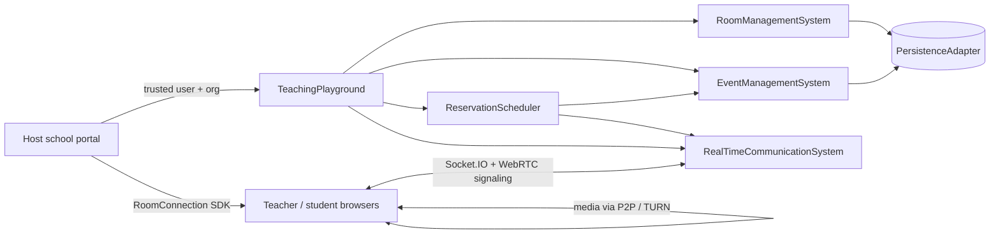
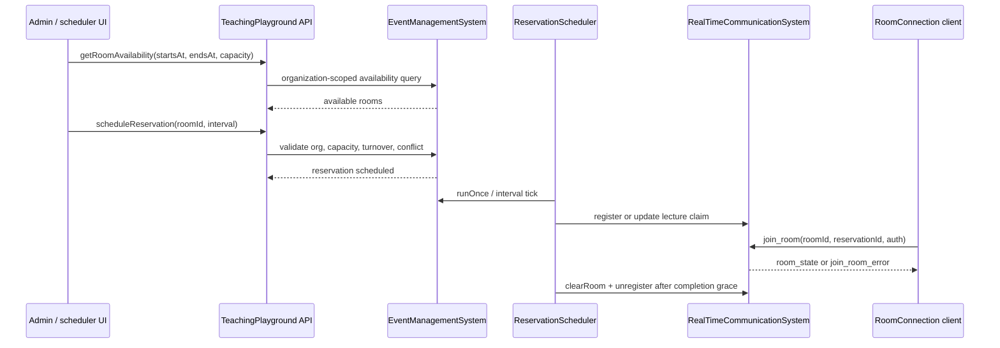
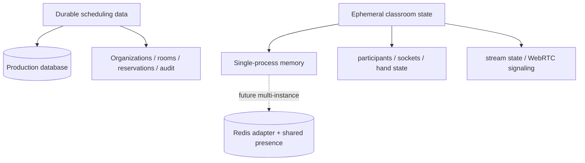

# Wolfmed Classroom

A TypeScript package powering Wolfmed Classroom realtime virtual classrooms with Socket.IO,
WebRTC signaling, organization-scoped room scheduling, reservation-aware
admission, and a diagnostic classroom harness.

Wolfmed Classroom is designed to be embedded by a host school portal or
training platform. The host owns authentication, persistent production storage,
and deployment infrastructure; this package provides the classroom domain,
realtime coordination, SDK client, and development tooling needed to validate
multi-room live instruction.

## Table of contents

- [What is included](#what-is-included)
- [Current capabilities](#current-capabilities)
- [Architecture](#architecture)
- [Scheduling and admission flow](#scheduling-and-admission-flow)
- [Installation](#installation)
- [Quick start](#quick-start)
- [Developer API reference](#developer-api-reference)
- [Using the SDK client](#using-the-sdk-client)
- [Development harness](#development-harness)
- [Development HTTP API](#development-http-api)
- [TURN relay validation](#turn-relay-validation)
- [Testing](#testing)
- [Configuration](#configuration)
- [Persistence model](#persistence-model)
- [Operational notes](#operational-notes)
- [Documentation map](#documentation-map)
- [Versioning](#versioning)
- [License](#license)

## What is included

| Area | What this package provides | Host responsibility |
|---|---|---|
| Realtime classroom | Socket.IO room membership, chat, participant events, moderation controls, recording notifications, WebRTC signaling | Run the HTTP/WebSocket server and provide trusted identity context |
| Scheduling | Organization-scoped rooms, reservations, availability search, conflict checks, lifecycle scheduler, turnover gap | Decide product UX, school calendars, and production database integration |
| Browser SDK | `RoomConnection` client for joining, messaging, streaming, screen share, recording, and TURN diagnostics | Integrate the SDK into the host frontend |
| Development tools | Standalone server, React classroom harness, Playwright specs, load/isolation scripts | Provide production deployment, monitoring, and secrets management |
| Persistence | JSON development store and adapter interfaces | Use a transactional production database for real scheduling correctness |

## Current capabilities

### Classroom runtime

- Multi-room Socket.IO isolation keyed by `roomId`.
- Authenticated join support through a host-provided identity provider.
- Chat with bounded room history.
- Participant presence, hand raise/lower, mute-all, mute participant, and kick.
- Teacher/admin broadcast stream status and browser-side WebRTC signaling.
- Client-side recording helpers and room-wide recording notifications.
- Explicit room cleanup that removes ephemeral room state and disconnects old
  cohort sockets.

### Rooms and reservations

- Organization-owned rooms with capacity, status, and media features.
- Reservation model with `startsAt`, `endsAt`, timezone, capacity, teacher,
  lifecycle status, and an optional normalized academic path.
- Availability search scoped by organization, capacity, status, and interval.
- Serialized overlap checks for the bundled single-process adapter.
- Configurable room turnover gap, defaulting to 15 minutes between cohorts.
- Scheduler transitions for `scheduled → open → in-progress → completed` with
  early-admission and completion-grace windows.
- Reservation-aware WebSocket admission enforcing trusted host launch claims,
  organization, reservation ID, lifecycle window, and capacity.
- Attendance foundation for durable attendance events, teacher-triggered
  snapshots, and finalized reports for completed reservations.

### Diagnostics and validation

- React classroom harness with **Rooms**, **Schedule**, and **Live classroom**
  views.
- Development HTTP management endpoints under `DEV_AUTH_ENABLED=true`.
- Multi-room isolation script for participant/chat/moderation/stream cleanup
  checks.
- TURN relay diagnostics with static or short-lived credentials and selected ICE
  candidate-pair inspection.

## Architecture



The high-level engine is `TeachingPlayground`. It composes durable room/event
operations with realtime classroom state and starts the reservation scheduler
when the server is initialized.

```typescript
import { createServer } from 'http'
import { TeachingPlayground } from '@teaching-playground/core'

const server = createServer()
const playground = new TeachingPlayground({
  commsConfig: {
    requireAuthentication: true,
    identityProvider: async ({ auth }) => validateToken(auth.token),
  },
})

playground.setCurrentUser(currentAdminUser)
playground.initialize(server)
server.listen(3001)
```

## Scheduling and admission flow




### Attendance foundation

Phase 2E.2 adds durable attendance primitives under reservation scope. Hosts can
record attendance events, capture teacher-triggered snapshots of current
participants, and finalize an idempotent attendance report after a reservation
is completed. Attendance mutations verify the reservation belongs to the active
organization, reject invalid timestamps and duplicate snapshot participants, and
only finalize reports for completed reservations.

### Host-owned launch claims

Phase 2E.1 keeps commercial and enrollment decisions in the host application.
When `requireLaunchClaims` is enabled, reservation-backed joins must provide a
host-verifiable launch decision. Configure `launchClaimVerifier` to validate the
host's signed or opaque token and return normalized claims with `allowed: true`,
`organizationId`, `reservationId`, `roomId`, `userId`, and optional `role`,
`notBefore`, and `expiresAt` fields. The engine does not call payment or
enrollment services; it only verifies that trusted host claims match the
Socket.IO identity and then applies runtime checks for reservation identity,
organization, lifecycle status, capacity, and room cleanup state.

### Normalized academic model

Phase 2E uses a host-agnostic academic hierarchy for scheduling:
`Organization → AcademicProgram → Curriculum → AcademicTerm → Course → Subject → Cohort → LectureReservation`.
Host applications such as Wolfmed Klasa keep accounts, payments, commercial
products, exams, and materials outside the engine, then map their records into
these stable IDs when creating reservations. Schools with different curricula
must normalize those structures into this model before calling the scheduling
API; plugin-based reshaping is intentionally deferred until real onboarding
proves the model too rigid.

Reservations can include `academicPath` with `programId`, `curriculumId`,
`termId`, `courseId`, `subjectId`, `cohortId`, and an optional neutral
`externalRef` back to the host record. `listReservations` accepts these IDs as
filters alongside organization, room, teacher, status, and date range filters.

Key scheduling rules:

- Calendar intervals are represented as `startsAt`/`endsAt` ISO timestamps.
- Active reservations in the same room cannot overlap.
- By default, another lecture may start only after the previous lecture has a
  15-minute turnover gap.
- The scheduler opens admission before the start time, marks the lecture
  in-progress at start, and completes it after the configured grace period.
- When a room is cleared, connected participants are removed from room memory and
  force-disconnected from the Socket.IO server.

## Installation

```bash
pnpm add @teaching-playground/core
```

Peer dependency:

```bash
pnpm add typescript
```

The package publishes ESM output and TypeScript declarations from `dist`.

## Quick start

### 1. Create an authenticated playground

```typescript
import { createServer } from 'http'
import { TeachingPlayground } from '@teaching-playground/core'

const server = createServer()
const playground = new TeachingPlayground({
  commsConfig: {
    allowedOrigins: ['https://school.example.com'],
    requireAuthentication: true,
    identityProvider: async ({ auth }) => {
      const user = await verifySession(auth.token)
      return user
    },
  },
})

playground.setCurrentUser({
  id: 'admin-1',
  username: 'admin',
  displayName: 'School Admin',
  organizationId: 'school-demo',
  role: 'admin',
  status: 'online',
})

playground.initialize(server)
server.listen(3001)
```

### 2. Create a room and reserve it

```typescript
const room = await playground.createRoom({
  name: 'Clinical Skills Lab',
  capacity: 24,
  features: {
    video: true,
    audio: true,
    chat: true,
    whiteboard: false,
    screenShare: true,
  },
})

const reservation = await playground.scheduleReservation({
  roomId: room.id,
  name: 'Patient communication workshop',
  teacherId: 'teacher-1',
  startsAt: '2026-09-01T15:00:00.000Z',
  endsAt: '2026-09-01T16:00:00.000Z',
  timezone: 'America/New_York',
  capacity: 20,
  createdBy: 'admin-1',
  academicPath: {
    programId: 'medicine',
    curriculumId: 'md-2026',
    termId: 'fall-2026',
    courseId: 'clinical-skills',
    subjectId: 'patient-communication',
    cohortId: 'group-a',
    externalRef: {
      provider: 'host-sis',
      type: 'class-section',
      id: 'section-123',
    },
  },
})
```

### 3. Join from the browser

```typescript
import { RoomConnection } from '@teaching-playground/core/room-connection'

const connection = new RoomConnection(room.id, teacherUser, 'https://api.example.com', {
  auth: { token: sessionToken },
  reservationId: reservation.id,
  launchClaims: hostSignedLaunchToken,
})

connection.on('connected', () => console.log('Joined classroom'))
connection.on('join_room_error', error => console.error('Admission denied', error))
connection.connect()
```

## Developer API reference

This README is the temporary technical reference until a dedicated
documentation site exists. All high-level APIs below live on
`TeachingPlayground`; lower-level systems are also exported for tests and
advanced embedding, but hosts should prefer the engine facade unless they are
supplying their own composition layer.

### Engine and identity

| API | Purpose | Notes |
|---|---|---|
| `new TeachingPlayground(config)` | Create the engine facade | Accepts `commsConfig`, scheduler timing, room turnover, and a custom `persistence` adapter |
| `setCurrentUser(user)` | Set trusted host identity for server-side API calls | `organizationId` scopes room, reservation, and attendance mutations |
| `initialize(httpServer)` | Attach Socket.IO and start the scheduler | Required for realtime browser joins |
| `getSchedulerStatus()` | Inspect scheduler health | Useful for development diagnostics and monitoring |
| `runSchedulerOnce(now?)` | Run one deterministic scheduler tick | Intended for tests, migrations, and controlled jobs |

### Room APIs

| API | Purpose |
|---|---|
| `createRoom({ name, capacity, features? })` | Create an organization-owned room |
| `getRooms()` | List rooms visible to the current organization |
| `getRoom(roomId)` | Fetch one room |
| `updateRoom(roomId, updates)` | Update room fields |
| `deleteRoom(roomId)` | Delete a room |
| `setRoomMaintenance(roomId, enabled)` | Toggle maintenance status for scheduling/availability checks |

### Reservation and scheduling APIs

| API | Purpose |
|---|---|
| `getRoomAvailability({ startsAt, endsAt, capacity?, excludeReservationId? })` | Find rooms that satisfy interval, capacity, maintenance, conflict, and turnover rules |
| `scheduleReservation(options)` | Create a lecture reservation for the current organization |
| `listReservations(filter?)` | Query reservations by room, teacher, status, date range, and academic path IDs |
| `rescheduleLecture(reservationId, { roomId?, startsAt?, endsAt })` | Move an active reservation while preserving conflict checks |
| `updateReservation(reservationId, updates)` | Update active reservation metadata, capacity, or academic path |
| `cancelReservation(reservationId, reason?)` | Mark an active reservation as cancelled |

`scheduleReservation` accepts:

```typescript
{
  roomId: string
  name: string
  teacherId?: string
  startsAt: string
  endsAt: string
  timezone: string
  capacity: number
  description?: string
  createdBy?: string
  academicPath?: ReservationAcademicPath
}
```

`ReservationAcademicPath` must include every normalized ID below when present.
`externalRef` is optional and exists only to map back to host-owned records.

```typescript
{
  programId: string
  curriculumId: string
  termId: string
  courseId: string
  subjectId: string
  cohortId: string
  externalRef?: {
    provider: string
    type: string
    id: string
    metadata?: Record<string, unknown>
  }
}
```

`listReservations` supports these academic filters: `programId`,
`curriculumId`, `termId`, `courseId`, `subjectId`, and `cohortId`. It also
supports `roomId`, `teacherId`, `status`, `from`, and `to`.

### Attendance APIs

Phase 2E.2 adds durable attendance primitives under reservation scope:

| API | Purpose | Important validation |
|---|---|---|
| `recordAttendanceEvent({ reservationId, type, userId, role, occurredAt?, capturedBy?, metadata? })` | Store one attendance event such as `joined`, `left`, `present`, or `snapshot` | Reservation must belong to the current organization; timestamp, role, and event type are validated |
| `captureAttendanceSnapshot({ reservationId, capturedBy, capturedAt?, participants })` | Store a teacher/admin snapshot and write one `snapshot` event per participant | Cancelled reservations reject snapshots; participant user IDs must be unique |
| `finalizeAttendanceReport(reservationId)` | Build and persist an idempotent report for a completed reservation | Only completed reservations can be finalized; repeated calls return the existing report |
| `getAttendanceReport(reservationId)` | Read a finalized report or `null` | Reservation must belong to the current organization |

Attendance report totals include unique participant count, role counts,
underlying attendance event count, and snapshot event count. Participant rows
include `firstSeenAt`, `lastSeenAt`, `eventCount`, and `snapshotCount`.

```typescript
await playground.recordAttendanceEvent({
  reservationId: reservation.id,
  type: 'joined',
  userId: 'student-1',
  role: 'student',
  occurredAt: '2026-09-01T15:02:00.000Z',
})

await playground.captureAttendanceSnapshot({
  reservationId: reservation.id,
  capturedBy: 'teacher-1',
  capturedAt: '2026-09-01T15:30:00.000Z',
  participants: [
    { userId: 'teacher-1', role: 'teacher', displayName: 'Dr. Rivera' },
    { userId: 'student-1', role: 'student', displayName: 'Alex' },
  ],
})

const report = await playground.finalizeAttendanceReport(reservation.id)
```

### Host-owned launch claims

When `commsConfig.requireLaunchClaims` is enabled, browser clients must pass
`launchClaims` in the `RoomConnection` options for reservation-backed joins. The
host verifier receives the opaque browser payload plus the authenticated join
context and returns normalized trusted claims.

```typescript
const playground = new TeachingPlayground({
  commsConfig: {
    requireAuthentication: true,
    identityProvider: verifySocketIdentity,
    requireLaunchClaims: true,
    launchClaimVerifier: async ({ claims, identity, roomId, reservationId }) => {
      const trusted = await verifyHostLaunchToken(claims)
      return {
        allowed: trusted.allowed,
        organizationId: trusted.organizationId,
        reservationId,
        roomId,
        userId: identity.id,
        role: trusted.role,
        notBefore: trusted.notBefore,
        expiresAt: trusted.expiresAt,
      }
    },
  },
})
```

The runtime rejects missing, invalid, expired, not-yet-valid, wrong-user,
wrong-role, wrong-room, wrong-reservation, and wrong-organization claims before
capacity/lifecycle admission succeeds.

## Using the SDK client

`RoomConnection` is the browser-facing SDK entry point.

```typescript
const stream = await navigator.mediaDevices.getUserMedia({ video: true, audio: true })
await connection.startStream(stream)
connection.sendMessage('Welcome everyone')
connection.raiseHand()
connection.muteAllParticipants() // teacher/admin only
```

Common events:

| Event | Purpose |
|---|---|
| `connected` | Emitted after server admission and `room_state` receipt |
| `room_state` | Current stream and participant snapshot |
| `message_received` / `message_history` | Chat messages |
| `user_joined` / `user_left` | Participant presence updates |
| `remote_stream_added` / `remote_stream_removed` | WebRTC remote media lifecycle |
| `mute_all`, `muted_by_teacher`, `kicked_from_room` | Moderation events |
| `room_cleared`, `room_closed` | Room lifecycle cleanup |
| `join_room_error` / `connection_error` / `webrtc_error` | Admission, transport, or media errors |

`RoomConnection` constructor options used most often by hosts:

| Option | Purpose |
|---|---|
| `auth` | Host credential payload forwarded to the Socket.IO identity provider |
| `reservationId` | Reservation identity for runtime admission checks |
| `organizationId` | Optional client-provided organization hint; server identity/claims still decide trust |
| `launchClaims` | Host-signed or opaque launch decision payload verified by the server when required |
| `iceServers` / `iceTransportPolicy` | Browser WebRTC ICE settings, including TURN relay-only diagnostics |

## Development harness

The repo includes a private React/Vite harness in `examples/classroom-harness`.
It exercises the public package APIs and development HTTP endpoints.

```bash
pnpm install
DEV_AUTH_ENABLED=true pnpm server:dev
pnpm harness:dev
```

Open `http://localhost:5173`.

Harness views:

- **Rooms** — create rooms, filter by capacity, toggle maintenance, and inspect
  catalog state.
- **Schedule** — search available rooms, schedule/reschedule/cancel lectures,
  view conflicts, and join eligible reservations.
- **Live classroom** — join a reservation or diagnostic room, test chat,
  participant controls, media, recording, screen share, and TURN diagnostics.

Development identity uses simple `role:name` tokens such as `teacher:maya`,
`student:alex`, or `admin:sam`. Do not enable `DEV_AUTH_ENABLED` in production.

## Development HTTP API

The standalone server exposes management routes only when
`DEV_AUTH_ENABLED=true`. Without that flag, API paths return a JSON
`DEV_API_DISABLED` response so the harness can show a setup hint instead of a
raw JSON parse error.

| Method | Path | Purpose |
|---|---|---|
| `GET` | `/api/rooms?minCapacity=0` | List development rooms |
| `POST` | `/api/rooms` | Create a room |
| `POST` | `/api/rooms/:id/maintenance` | Toggle maintenance with `{ "enabled": true }` |
| `GET` | `/api/reservations` | List reservations with room/teacher/status/date/academic filters |
| `POST` | `/api/reservations` | Schedule a reservation, including optional `academicPath` |
| `POST` | `/api/reservations/:id/reschedule` | Reschedule a reservation |
| `POST` | `/api/reservations/:id/cancel` | Cancel a reservation |
| `GET` | `/api/availability` | Query room availability by interval/capacity |
| `POST` | `/api/reservations/:id/attendance/snapshot` | Capture an attendance snapshot |
| `POST` | `/api/reservations/:id/attendance/report` | Finalize an attendance report |
| `GET` | `/api/reservations/:id/attendance/report` | Read a finalized attendance report |
| `GET` | `/api/turn` | Return browser-safe TURN/ICE settings |

These routes are for local validation and the included harness. Production
hosts should expose their own authenticated API, call `TeachingPlayground`, and
persist through a production `PersistenceAdapter`.

## TURN relay validation

TURN configuration is host-provided. The standalone development server exposes a
browser-safe `/api/turn` endpoint only in development auth mode.

```bash
DEV_AUTH_ENABLED=true \
TURN_URLS=turn:turn.example.com:3478,turns:turn.example.com:5349 \
TURN_USERNAME=school-demo \
TURN_CREDENTIAL='replace-with-provider-password' \
TURN_FORCE_RELAY=true \
pnpm server:dev
```

For production-style short-lived credentials, use `TURN_SHARED_SECRET` instead
of `TURN_CREDENTIAL`. See [TURN-RELAY.md](TURN-RELAY.md) for full setup,
security guidance, and relay-only validation steps.

## Testing

Run the core Jest suite:

```bash
pnpm test --runInBand
```

Build TypeScript:

```bash
pnpm build
```

Lint source and scripts:

```bash
pnpm lint
```

Run browser harness E2E tests:

```bash
pnpm --dir examples/classroom-harness test:e2e
```

Run multi-room isolation validation:

```bash
pnpm isolation:test
```

Run TURN diagnostics E2E with host-provided TURN settings:

```bash
CI=1 \
TURN_URLS=turn:turn.example.test:3478 \
TURN_USERNAME=demo \
TURN_CREDENTIAL=secret \
TURN_FORCE_RELAY=true \
pnpm --dir examples/classroom-harness test:e2e --grep "TURN relay diagnostics"
```

## Configuration

### Engine configuration

`TeachingPlayground` accepts configuration for realtime communication,
scheduler timing, room turnover, and host-provided persistence.

Important scheduler defaults:

| Setting | Default | Purpose |
|---|---:|---|
| `earlyAdmissionMs` | 10 minutes | How early participants can enter before `startsAt` |
| `completionGraceMs` | 5 minutes | How long a completed lecture remains claimable before cleanup |
| `schedulerIntervalMs` | 15 seconds | Interval worker cadence |
| `roomTurnoverMs` | 15 minutes | Required empty-room gap between consecutive reservations |

### Development server environment

| Variable | Purpose |
|---|---|
| `PORT` | HTTP/WebSocket port, default `3001` |
| `ALLOWED_ORIGINS` | Comma-separated browser origins for Socket.IO/CORS |
| `NEXT_PUBLIC_WS_URL` | Optional origin fallback for development |
| `DEV_AUTH_ENABLED` | Enables development management APIs and `role:name` auth |
| `TURN_URLS` | Comma-separated TURN URLs |
| `TURN_USERNAME` / `TURN_CREDENTIAL` | Static TURN credentials |
| `TURN_SHARED_SECRET` / `TURN_TTL_SECONDS` | Short-lived TURN credential mode |
| `TURN_FORCE_RELAY` | Defaults harness to relay-only ICE when true |

## Persistence model



The bundled JSON database is a development adapter. Production deployments
should use a transactional database for organizations, rooms, reservations, and
audit history. Conflict detection and reservation insertion must happen in one
transaction in production.

Redis is not required for multiple rooms on one backend instance. Add Redis and
a Socket.IO Redis adapter only when running multiple backend instances that must
share live classroom state.

## Operational notes

- Scope every durable query and mutation by trusted `organizationId`.
- Treat direct room-ID joins as diagnostics; production joins should carry a
  reservation/live-session identity.
- Keep TURN secrets server-side and prefer short-lived credentials.
- Use sticky sessions or compatible WebSocket routing when scaling horizontally.
- Monitor WebSocket connections, active rooms, scheduler heartbeat, event-loop
  delay, memory, database health, Redis health, and TURN reachability.
- Local load numbers are regression baselines, not production capacity promises.

## Documentation map

- [PRODUCT-IMPLEMENTATION-PLAN.md](PRODUCT-IMPLEMENTATION-PLAN.md) — production
  classroom and scheduling delivery plan.
- [TURN-RELAY.md](TURN-RELAY.md) — TURN setup, relay-only validation, and
  troubleshooting.
- [LOAD-TESTING.md](LOAD-TESTING.md) — load and isolation validation notes.
- [MIGRATION-v2.4.md](MIGRATION-v2.4.md) — reservation model migration notes.
- [MIGRATION-v2.6.md](MIGRATION-v2.6.md) — scheduler/admission migration notes.
- [examples/classroom-harness/README.md](examples/classroom-harness/README.md) —
  harness-specific usage.

## Versioning

This package follows semantic versioning. Backwards-compatible capabilities use
minor versions; fixes and documentation updates use patch versions. See
[CHANGELOG.md](CHANGELOG.md) for release history.

## License

MIT
