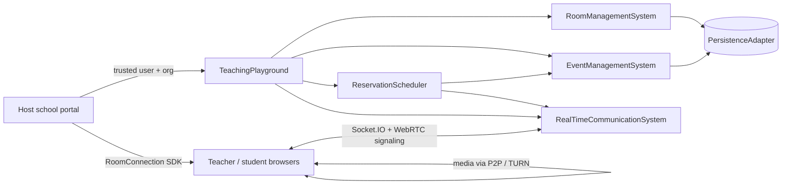
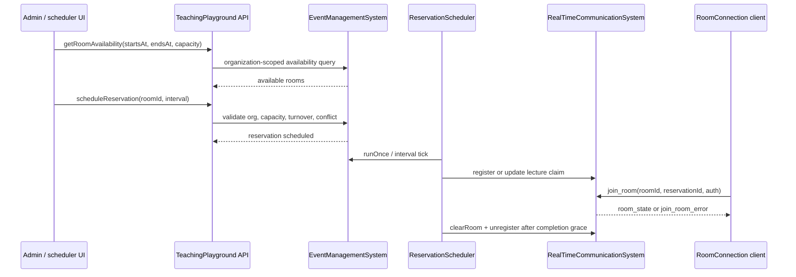
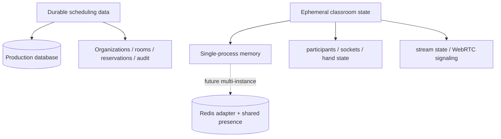

# Teaching Playground Core

A TypeScript package for building realtime virtual classrooms with Socket.IO,
WebRTC signaling, organization-scoped room scheduling, reservation-aware
admission, and a diagnostic classroom harness.

Teaching Playground Core is designed to be embedded by a host school portal or
training platform. The host owns authentication, persistent production storage,
and deployment infrastructure; this package provides the classroom domain,
realtime coordination, SDK client, and development tooling needed to validate
multi-room live instruction.

## Table of contents

- [What is included](#what-is-included)
- [Current capabilities](#current-capabilities)
- [Architecture](#architecture)
- [Scheduling and admission flow](#scheduling-and-admission-flow)
- [Installation](#installation)
- [Quick start](#quick-start)
- [Using the SDK client](#using-the-sdk-client)
- [Development harness](#development-harness)
- [TURN relay validation](#turn-relay-validation)
- [Testing](#testing)
- [Configuration](#configuration)
- [Persistence model](#persistence-model)
- [Operational notes](#operational-notes)
- [Documentation map](#documentation-map)
- [Versioning](#versioning)
- [License](#license)

## What is included

| Area | What this package provides | Host responsibility |
|---|---|---|
| Realtime classroom | Socket.IO room membership, chat, participant events, moderation controls, recording notifications, WebRTC signaling | Run the HTTP/WebSocket server and provide trusted identity context |
| Scheduling | Organization-scoped rooms, reservations, availability search, conflict checks, lifecycle scheduler, turnover gap | Decide product UX, school calendars, and production database integration |
| Browser SDK | `RoomConnection` client for joining, messaging, streaming, screen share, recording, and TURN diagnostics | Integrate the SDK into the host frontend |
| Development tools | Standalone server, React classroom harness, Playwright specs, load/isolation scripts | Provide production deployment, monitoring, and secrets management |
| Persistence | JSON development store and adapter interfaces | Use a transactional production database for real scheduling correctness |

## Current capabilities

### Classroom runtime

- Multi-room Socket.IO isolation keyed by `roomId`.
- Authenticated join support through a host-provided identity provider.
- Chat with bounded room history.
- Participant presence, hand raise/lower, mute-all, mute participant, and kick.
- Teacher/admin broadcast stream status and browser-side WebRTC signaling.
- Client-side recording helpers and room-wide recording notifications.
- Explicit room cleanup that removes ephemeral room state and disconnects old
  cohort sockets.

### Rooms and reservations

- Organization-owned rooms with capacity, status, and media features.
- Reservation model with `startsAt`, `endsAt`, timezone, capacity, teacher, and
  lifecycle status.
- Availability search scoped by organization, capacity, status, and interval.
- Serialized overlap checks for the bundled single-process adapter.
- Configurable room turnover gap, defaulting to 15 minutes between cohorts.
- Scheduler transitions for `scheduled → open → in-progress → completed` with
  early-admission and completion-grace windows.
- Reservation-aware WebSocket admission enforcing organization, reservation ID,
  lifecycle window, and capacity.

### Diagnostics and validation

- React classroom harness with **Rooms**, **Schedule**, and **Live classroom**
  views.
- Development HTTP management endpoints under `DEV_AUTH_ENABLED=true`.
- Multi-room isolation script for participant/chat/moderation/stream cleanup
  checks.
- TURN relay diagnostics with static or short-lived credentials and selected ICE
  candidate-pair inspection.

## Architecture



The high-level engine is `TeachingPlayground`. It composes durable room/event
operations with realtime classroom state and starts the reservation scheduler
when the server is initialized.

```typescript
import { createServer } from 'http'
import { TeachingPlayground } from '@teaching-playground/core'

const server = createServer()
const playground = new TeachingPlayground({
  commsConfig: {
    requireAuthentication: true,
    identityProvider: async ({ auth }) => validateToken(auth.token),
  },
})

playground.setCurrentUser(currentAdminUser)
playground.initialize(server)
server.listen(3001)
```

## Scheduling and admission flow



Key scheduling rules:

- Calendar intervals are represented as `startsAt`/`endsAt` ISO timestamps.
- Active reservations in the same room cannot overlap.
- By default, another lecture may start only after the previous lecture has a
  15-minute turnover gap.
- The scheduler opens admission before the start time, marks the lecture
  in-progress at start, and completes it after the configured grace period.
- When a room is cleared, connected participants are removed from room memory and
  force-disconnected from the Socket.IO server.

## Installation

```bash
pnpm add @teaching-playground/core
```

Peer dependency:

```bash
pnpm add typescript
```

The package publishes ESM output and TypeScript declarations from `dist`.

## Quick start

### 1. Create an authenticated playground

```typescript
import { createServer } from 'http'
import { TeachingPlayground } from '@teaching-playground/core'

const server = createServer()
const playground = new TeachingPlayground({
  commsConfig: {
    allowedOrigins: ['https://school.example.com'],
    requireAuthentication: true,
    identityProvider: async ({ auth }) => {
      const user = await verifySession(auth.token)
      return user
    },
  },
})

playground.setCurrentUser({
  id: 'admin-1',
  username: 'admin',
  displayName: 'School Admin',
  organizationId: 'school-demo',
  role: 'admin',
  status: 'online',
})

playground.initialize(server)
server.listen(3001)
```

### 2. Create a room and reserve it

```typescript
const room = await playground.createRoom({
  name: 'Clinical Skills Lab',
  capacity: 24,
  features: {
    video: true,
    audio: true,
    chat: true,
    whiteboard: false,
    screenShare: true,
  },
})

const reservation = await playground.scheduleReservation({
  roomId: room.id,
  name: 'Patient communication workshop',
  teacherId: 'teacher-1',
  startsAt: '2026-09-01T15:00:00.000Z',
  endsAt: '2026-09-01T16:00:00.000Z',
  timezone: 'America/New_York',
  capacity: 20,
  createdBy: 'admin-1',
})
```

### 3. Join from the browser

```typescript
import { RoomConnection } from '@teaching-playground/core/room-connection'

const connection = new RoomConnection(room.id, teacherUser, 'https://api.example.com', {
  auth: { token: sessionToken },
  reservationId: reservation.id,
})

connection.on('connected', () => console.log('Joined classroom'))
connection.on('join_room_error', error => console.error('Admission denied', error))
connection.connect()
```

## Using the SDK client

`RoomConnection` is the browser-facing SDK entry point.

```typescript
const stream = await navigator.mediaDevices.getUserMedia({ video: true, audio: true })
await connection.startStream(stream)
connection.sendMessage('Welcome everyone')
connection.raiseHand()
connection.muteAllParticipants() // teacher/admin only
```

Common events:

| Event | Purpose |
|---|---|
| `connected` | Emitted after server admission and `room_state` receipt |
| `room_state` | Current stream and participant snapshot |
| `message_received` / `message_history` | Chat messages |
| `user_joined` / `user_left` | Participant presence updates |
| `remote_stream_added` / `remote_stream_removed` | WebRTC remote media lifecycle |
| `mute_all`, `muted_by_teacher`, `kicked_from_room` | Moderation events |
| `room_cleared`, `room_closed` | Room lifecycle cleanup |
| `join_room_error` / `connection_error` / `webrtc_error` | Admission, transport, or media errors |

## Development harness

The repo includes a private React/Vite harness in `examples/classroom-harness`.
It exercises the public package APIs and development HTTP endpoints.

```bash
pnpm install
DEV_AUTH_ENABLED=true pnpm server:dev
pnpm harness:dev
```

Open `http://localhost:5173`.

Harness views:

- **Rooms** — create rooms, filter by capacity, toggle maintenance, and inspect
  catalog state.
- **Schedule** — search available rooms, schedule/reschedule/cancel lectures,
  view conflicts, and join eligible reservations.
- **Live classroom** — join a reservation or diagnostic room, test chat,
  participant controls, media, recording, screen share, and TURN diagnostics.

Development identity uses simple `role:name` tokens such as `teacher:maya`,
`student:alex`, or `admin:sam`. Do not enable `DEV_AUTH_ENABLED` in production.

## TURN relay validation

TURN configuration is host-provided. The standalone development server exposes a
browser-safe `/api/turn` endpoint only in development auth mode.

```bash
DEV_AUTH_ENABLED=true \
TURN_URLS=turn:turn.example.com:3478,turns:turn.example.com:5349 \
TURN_USERNAME=school-demo \
TURN_CREDENTIAL='replace-with-provider-password' \
TURN_FORCE_RELAY=true \
pnpm server:dev
```

For production-style short-lived credentials, use `TURN_SHARED_SECRET` instead
of `TURN_CREDENTIAL`. See [TURN-RELAY.md](TURN-RELAY.md) for full setup,
security guidance, and relay-only validation steps.

## Testing

Run the core Jest suite:

```bash
pnpm test --runInBand
```

Build TypeScript:

```bash
pnpm build
```

Lint source and scripts:

```bash
pnpm lint
```

Run browser harness E2E tests:

```bash
pnpm --dir examples/classroom-harness test:e2e
```

Run multi-room isolation validation:

```bash
pnpm isolation:test
```

Run TURN diagnostics E2E with host-provided TURN settings:

```bash
CI=1 \
TURN_URLS=turn:turn.example.test:3478 \
TURN_USERNAME=demo \
TURN_CREDENTIAL=secret \
TURN_FORCE_RELAY=true \
pnpm --dir examples/classroom-harness test:e2e --grep "TURN relay diagnostics"
```

## Configuration

### Engine configuration

`TeachingPlayground` accepts configuration for realtime communication,
scheduler timing, room turnover, and host-provided persistence.

Important scheduler defaults:

| Setting | Default | Purpose |
|---|---:|---|
| `earlyAdmissionMs` | 10 minutes | How early participants can enter before `startsAt` |
| `completionGraceMs` | 5 minutes | How long a completed lecture remains claimable before cleanup |
| `schedulerIntervalMs` | 15 seconds | Interval worker cadence |
| `roomTurnoverMs` | 15 minutes | Required empty-room gap between consecutive reservations |

### Development server environment

| Variable | Purpose |
|---|---|
| `PORT` | HTTP/WebSocket port, default `3001` |
| `ALLOWED_ORIGINS` | Comma-separated browser origins for Socket.IO/CORS |
| `NEXT_PUBLIC_WS_URL` | Optional origin fallback for development |
| `DEV_AUTH_ENABLED` | Enables development management APIs and `role:name` auth |
| `TURN_URLS` | Comma-separated TURN URLs |
| `TURN_USERNAME` / `TURN_CREDENTIAL` | Static TURN credentials |
| `TURN_SHARED_SECRET` / `TURN_TTL_SECONDS` | Short-lived TURN credential mode |
| `TURN_FORCE_RELAY` | Defaults harness to relay-only ICE when true |

## Persistence model



The bundled JSON database is a development adapter. Production deployments
should use a transactional database for organizations, rooms, reservations, and
audit history. Conflict detection and reservation insertion must happen in one
transaction in production.

Redis is not required for multiple rooms on one backend instance. Add Redis and
a Socket.IO Redis adapter only when running multiple backend instances that must
share live classroom state.

## Operational notes

- Scope every durable query and mutation by trusted `organizationId`.
- Treat direct room-ID joins as diagnostics; production joins should carry a
  reservation/live-session identity.
- Keep TURN secrets server-side and prefer short-lived credentials.
- Use sticky sessions or compatible WebSocket routing when scaling horizontally.
- Monitor WebSocket connections, active rooms, scheduler heartbeat, event-loop
  delay, memory, database health, Redis health, and TURN reachability.
- Local load numbers are regression baselines, not production capacity promises.

## Documentation map

- [PRODUCT-IMPLEMENTATION-PLAN.md](PRODUCT-IMPLEMENTATION-PLAN.md) — production
  classroom and scheduling delivery plan.
- [TURN-RELAY.md](TURN-RELAY.md) — TURN setup, relay-only validation, and
  troubleshooting.
- [LOAD-TESTING.md](LOAD-TESTING.md) — load and isolation validation notes.
- [MIGRATION-v2.4.md](MIGRATION-v2.4.md) — reservation model migration notes.
- [MIGRATION-v2.6.md](MIGRATION-v2.6.md) — scheduler/admission migration notes.
- [examples/classroom-harness/README.md](examples/classroom-harness/README.md) —
  harness-specific usage.

## Versioning

This package follows semantic versioning. Backwards-compatible capabilities use
minor versions; fixes and documentation updates use patch versions. See
[CHANGELOG.md](CHANGELOG.md) for release history.

## License

MIT
